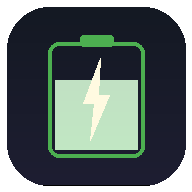
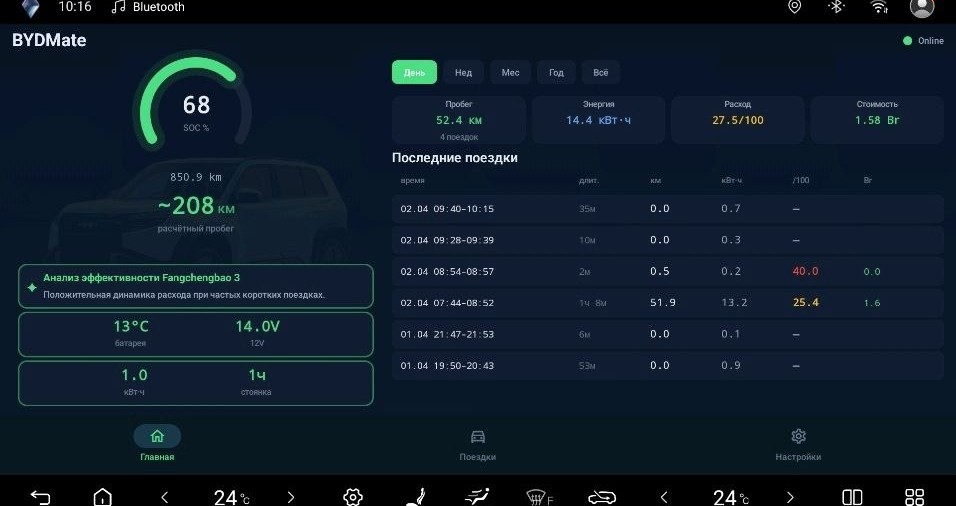
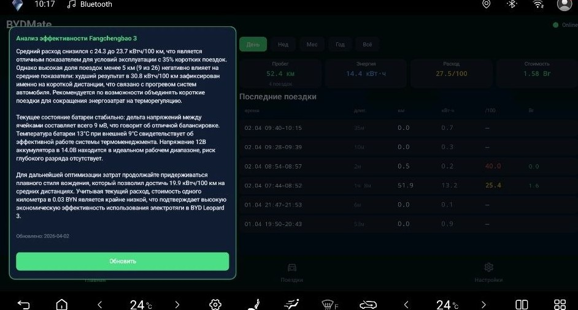
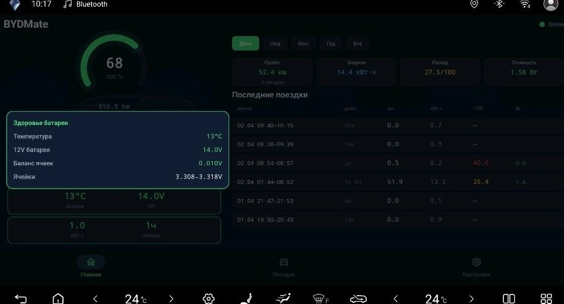
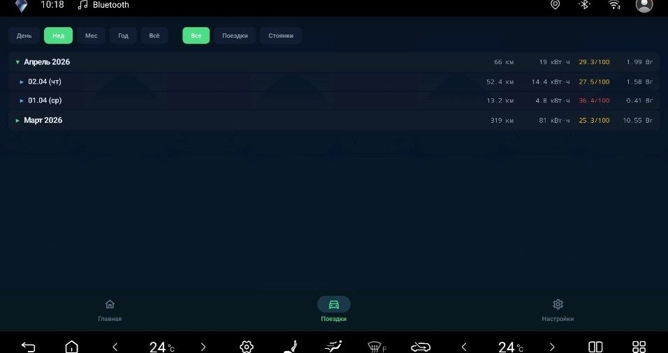
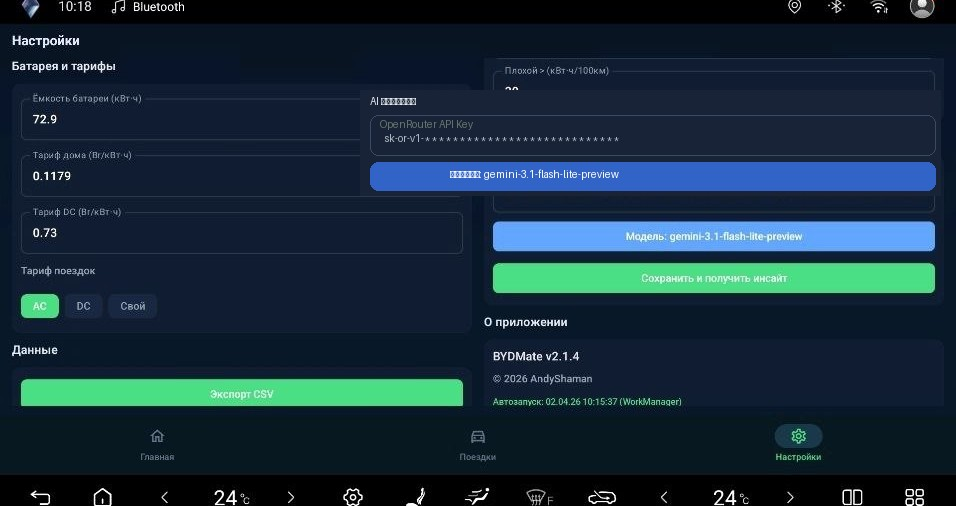
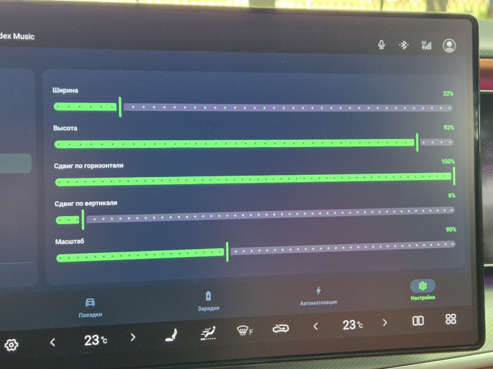
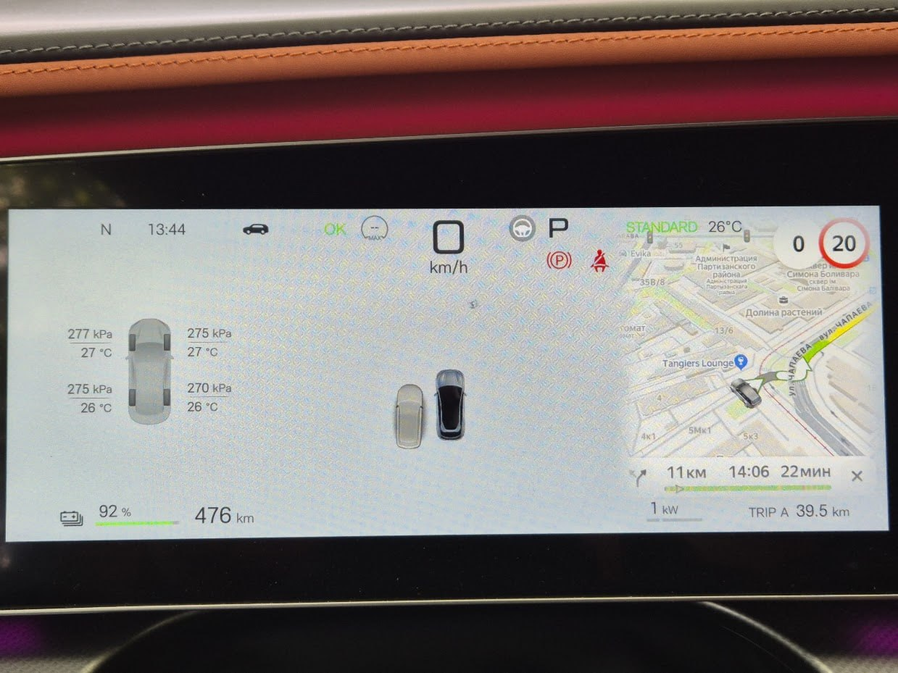
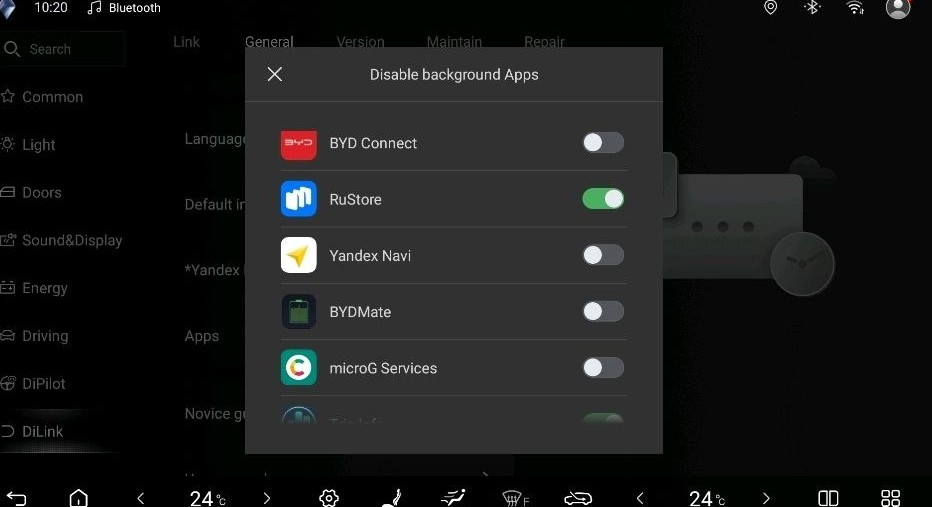

<div align="center">



# BYDMate

### Trip Logger & Energy Analytics for BYD DiLink 5.0

[](https://developer.android.com)
[](https://kotlinlang.org)
[](https://developer.android.com/jetpack/compose)
[](LICENSE)
[](https://github.com/AndyShaman/BYDMate/releases)
[](SUPPORT.md)

[English](README.en.md) | [中文](README.zh.md) | **Русский**

**Реальный расход, GPS-маршруты, автоматизация, AI-аналитика — локально, облако только по желанию.**

Разделение экрана 1/3 и 2/3, навигация на приборной панели, подсказки Яндекс Навигатора на лобовом стекле, камеры слепых зон по поворотнику, голосовой помощник по-русски, телеметрия в ABRP.

Проверено на Leopard 3 (方程豹豹3), есть поддержка Sea Lion 07, Song, Atto 3, Seal, Han. DiLink 3.0, 4.0, 5.0, 5.1 и прошивки с новым интерфейсом UI7 (OTA V1.6).

[Возможности](#возможности) | [Скриншоты](#скриншоты) | [Автоматизация](#автоматизация) | [Вывод на приборку](#вывод-на-приборку) | [HUD](#hud) | [Разделение экрана](#разделение-экрана) | [Голосовой агент](#голосовой-ai-агент) | [AI Инсайты](#ai-инсайты) | [ABRP](#abrp--live-телеметрия) | [Установка](#установка) | [Сборка](#сборка-из-исходников) | [Релизы](https://github.com/AndyShaman/BYDMate/releases) | [Поддержать](SUPPORT.md)

</div>

---

## Зачем это нужно

Штатный бортовой компьютер BYD **занижает расход на 10-30%**. BYDMate берёт данные напрямую из BMS (energydata) и показывает реальное потребление. Плюс данные, которых нет в штатной системе: расход на стоянке, баланс ячеек, стоимость поездок, AI-аналитика.

Все основные функции (поездки, зарядки, автоматизации, локальные инсайты, офлайн голосовой агент) работают локально на DiLink и не требуют интернета. Облачные функции выключены по умолчанию и включаются только вручную вводом ключа. Что именно и когда уходит в сеть, описано в разделе [«Данные и сеть»](#данные-и-сеть).

---

## Что нового

Главное в версии 3.18.1.

**Окно поездки переделано.** В шапке дата и день недели, кнопка закрытия. Новое: одометр на старте и на финише, время в движении, стоимость на 100 км, изменение заряда в процентах и температура за бортом в начале и в конце. Одометр пишется только для поездок после обновления.

**Автоматизация списком или карточками.** Переключатель в шапке вкладки показывает правила компактным списком или карточками в три колонки, выбор запоминается. У каждого правила видно, сколько раз и когда оно срабатывало.

**Главная стала просторнее.** Последних поездок всегда шесть, нижняя панель вкладок стала ниже.

Главное в версии 3.18.0.

**Конфигурация в одном месте.** Кнопка «Сохранить конфигурацию» заменила экспорт CSV, экспорт настроек и ручной бэкап. Вы выбираете, что сохранить: поездки и зарядки, настройки с тарифами, ключи. При восстановлении можно вернуть только нужные части. Подробнее в разделе [«Сохранение конфигурации и Telegram-бот»](#сохранение-конфигурации-и-telegram-бот).

**Автосохранение и копия в Telegram.** Раз в день, неделю или месяц приложение само сохраняет копию при запуске машины. В Download хранятся 5 последних копий, и каждая приходит в ваш Telegram-бот.

**Автоматизацией можно поделиться.** Кнопка «Поделиться» сохраняет правило в файл без ваших номеров, контактов и мест. Кнопка «Импорт» добавляет правило из такого файла, по умолчанию выключенным. Подробнее в разделе «Автоматизация».

**Тестовый запуск правила.** В редакторе автоматизации кнопка «Тестовый запуск» сразу выполняет все действия, не дожидаясь условия.

**Голосовые команды по списку фраз.** Встроенные офлайн-команды теперь это закреплённый список частых русских фраз. Фраза из списка выполняется без интернета, всё остальное уходит агенту. Окна и люк открываются на долю: «наполовину», «на 50 процентов», «чуть-чуть», «полностью». Подробнее в разделе «Голосовой AI-агент».

**Размер текста.** Настройки → Приложение → «Размер текста»: обычный, крупный или очень крупный. Меняются экраны приложения и окна голосового агента, виджет и приборка остаются как есть.

**TRIP сбрасывается после зарядки.** Счётчики TRIP 1 и TRIP 2 могут обнуляться сами: после любой зарядки, только AC, только DC или только после зарядки до 100%. Настройка своя у каждого счётчика, выбирается в окне счётчика.

**Понятная строка ADB.** На Главной и в Настройках строка состояния говорит, почему не работает управление машиной: ADB не включён, выключился после перезагрузки, нет доступа или не запустился помощник. По нажатию открывается подсказка с действием. В мастере первого запуска появился шаг «ADB» с проверкой подключения.

**Подогрев руля и мощность разряда.** Подогрев руля можно включать и выключать из автоматизации и голосом, на машинах с подогревом руля. На экране «Техника» в лимитах BMS появилась строка «макс. мощность разряда», та же цифра, что у диагностических сканеров.

---

## Возможности

| | Функция | Описание |
|---|---------|----------|
| **BMS** | Реальный расход | Данные BMS (energydata), не бортовой компьютер. Тренд по скользящему окну 25 км |
| **GPS** | Трекинг поездок | GPS-маршруты, дистанция, скорость |
| **Charge** | Зарядки | Автоматическая запись AC/DC, статистика за период и за всё время, ручное добавление и редактирование |
| **AI** | Инсайты | Анализ вождения: локальные правила на устройстве (по умолчанию) или LLM через OpenRouter |
| **TRIP** | Счётчики TRIP 1/2 | Пробег, расход, время и стоимость с момента сброса (как в машине); сброс долгим нажатием, подробности по касанию |
| **Bat** | Здоровье батареи и «Техника» | Карточка: SoH (Leopard 3, DiLink 3.0), температура, 12V, разброс ячеек, изоляция. Тап открывает экран «Техника» с живыми параметрами батареи, моторов, климата и шин, включая долю мощности перед/зад в процентах |
| **Map** | Карта маршрута | osmdroid (OpenStreetMap) в деталях поездки |
| **Rules** | Автоматизация | Правила WHEN→THEN: триггеры по параметрам → команды управления машиной |
| **Cluster** | Вывод на приборку | Вывод выбранного приложения на приборную панель кнопкой руля (по умолчанию правая звезда) |
| **HUD** | Проекция на лобовое | Манёвры, дистанция и знак ограничения скорости из Яндекс Навигатора на заводском проекционном дисплее |
| **Split** | Разделение экрана | Два приложения сразу: окнами BYDMate в пропорции 1/3 и 2/3 либо штатным разделением прошивки |
| **Cam** | Камеры слепых зон | Камера нужной стороны по включённому поворотнику: на приборке или в окошке на экране |
| **Voice** | Голосовой агент | Русский офлайн-ассистент: распознавание речи на устройстве, AI-агент (32 инструмента), нейросетевая озвучка |
| **Widget** | Плавающий виджет | 7 полей поверх других приложений: SOC, запас хода, расход + тренд, время, t° салона, t° батареи, 12V |
| **Auto** | Автозапуск | WorkManager, запускается при включении |
| **Backup** | Сохранение конфигурации | Поездки, зарядки, настройки и ключи в одном архиве в Download, восстановление по частям, автосохранение по расписанию с копией в ваш Telegram-бот |
| **Share** | Обмен автоматизациями | Правило в файл без номеров, контактов и ваших мест; импорт чужого правила с предпросмотром |
| **Aa** | Размер текста | Обычный, крупный или очень крупный текст на экранах приложения и в окнах голосового агента |

---

## Скриншоты

**Dashboard**



Вокруг SOC-кольца расположены четыре значения в стиле плавающего виджета: сверху длительность поездки, одометр и температура - в салоне и за бортом в одном слоте (если машина не сообщает наружную температуру, слот показывает только температуру в салоне, как раньше); снизу пробег текущей поездки, расчётный запас хода и расход текущей поездки со стрелкой тренда. Цвета и логика тренда такие же, как в плавающем виджете, поэтому информация читается одинаково и на главном экране, и поверх других приложений.

Ниже кольца: AI-инсайт, малая карточка здоровья батареи (SoH на Leopard 3 и DiLink 3.0, температура, 12V), два счётчика TRIP 1 и TRIP 2, последние поездки, фильтр периода. Каждый счётчик показывает пробег, расход в кВт·ч (включая стоянку), время в пути и стоимость с момента сброса. Долгое нажатие сбрасывает счётчик, касание открывает детали. В окне счётчика можно включить сброс после зарядки: после любой, только AC, только DC или только после зарядки до 100%.

**AI Инсайты**



*Анализ эффективности вождения — расход, тренды, батарея, рекомендации (локально или через LLM)*

**Здоровье батареи**



*Температура, SoH (Leopard 3, DiLink 3.0), 12V аккумулятор, баланс ячеек, напряжение*

**Поездки**



*Аккордеон Месяц > День > Поездка с фильтрами и цветовой индикацией расхода*

Чип **«Температура»** над списком открывает экран «Расход и температура»: точка на каждую поездку длиннее 5 км, линия медиан по 5-градусным полосам, медианы по холоду (ниже 0 °C), межсезонью (0…15 °C) и теплу (выше 15 °C) и вывод, на сколько процентов расход в холод выше. Поездки короче 5 км в график не попадают: там всё съедает прогрев. Нужно 8 поездок с температурой и разброс хотя бы в 15 °C, иначе экран честно скажет, чего не хватает.

В окне поездки видно одометр на старте и на финише, время в движении, стоимость на 100 км, изменение заряда в процентах и температуру за бортом в начале и в конце. Одометр пишется только для поездок после обновления.

**Автоматизация**


*Правила КОГДА→ТОГДА, редактор условий и действий, настройки срабатывания*

**Настройки**



*Разделы: Голос-агент, Виджет, Дисплей, Разделение экрана, Авто и батарея, Интеграции, Сервис и данные, Приложение*

**Разделение экрана**


*Две панели 1/3 и 2/3, виджет BYDMate поверх*


---

## Автоматизация

Вкладка **Автоматизация** позволяет создавать правила для автоматического управления автомобилем напрямую через системный интерфейс машины.

### Принцип работы

**КОГДА** условие выполняется **→ ТОГДА** выполнить команду.

Примеры:
- SOC < 20% → включить внутреннюю циркуляцию
- Скорость > 0 → закрыть шторку
- Температура за бортом < 0 → включить подогрев зеркал

### Возможности

| | Описание |
|---|----------|
| **Триггеры** | SOC, скорость, температура, поворотник, передача, двери, окна, люк, багажники, давление шин, режим езды, точки-геозоны, время суток, точное время и промежуток с днями недели, клавиша руля, тап по виджету, голосовая фраза, запуск сервиса, появление интернета и др. Поворотники, передача, двери, окна, багажники и датчики слепых зон приходят в приложение в момент события, а не по опросу |
| **Команды** | Окна (включая отдельные — водителя и пассажира), климат, свет, замки, люк, зеркала — напрямую через системный интерфейс машины. Подогрев руля на машинах, где он есть |
| **17 видов действий** | Команда автомобилю, уведомление, запуск приложения, звонок, маршрут в Я.Навигаторе, открыть URL, Яндекс.Музыка, запуск ролика на YouTube, пауза, громкость медиа, охранный режим, точка доступа Wi-Fi, озвучить текст, запрос агенту, главный экран BYDMate, вывод на приборку, разделение экрана (запуск, закрытие, переключение). У команд машины, охранного режима и вывода на приборку есть вариант «Переключить» |
| **Edge trigger** | Срабатывает только при переходе false→true (не повторяется каждые 3 сек) |
| **Cooldown** | Настраиваемая пауза между срабатываниями |
| **Overlay-подтверждение** | Всплывающее окно «Отмена / Выполнить» перед действием. Таймаут 15 с → автоотмена |
| **Безопасность** | Окна не открываются на скорости > 120 км/ч, люк > 80 км/ч, двери не отпираются > 30 км/ч, CAN/SHELL команды заблокированы |
| **Журнал** | Лог всех срабатываний с результатами |
| **Шаблоны** | 6 готовых правил для быстрого старта |
| **Выполнить сейчас** | Ручной запуск правила из редактора, мимо триггеров и cooldown |

**«Переключить» — это третий вариант рядом с самим действием, а не отдельный пункт.** В списке команд под парой «открыть / закрыть» стоит строка вида «Багажник: переключить», а у охранного режима и вывода на приборку к кнопкам «Включить» и «Выключить» добавилась кнопка «Переключить».

Переключать умеют: багажник, передний багажник, люк, замки, аварийку, климат, подогрев и обдув сидений водителя и пассажира, подогрев руля, вывод на приборку и режим охраны. Состояние берётся из машины: что открыто — закроется, что выключено — включится. Сиденье, которое сейчас работает, выключится, а выключенное вернётся на ту ступень, которую вы задавали последней (по умолчанию третью). Если машина не сообщает состояние, действие честно откажется и напишет об этом, а не будет угадывать.

Правила, созданные в прошлых версиях, продолжают работать и открываются на редактирование как раньше — менять ничего не нужно.

**Списки команд и параметров свёрнуты по разделам.** Открыт только раздел с текущим выбором, остальные разворачиваются тапом по заголовку.

**Тестовый запуск.** В редакторе правила кнопка «Тестовый запуск» сразу выполняет все действия, как будто сработало условие. Срабатывание при этом не засчитывается. Открытие окон, люка и переднего багажника и отпирание дверей пропускаются, если нет свежих данных о скорости: не старше 10 секунд при работающем сервисе. Нераспознанная команда тоже пропускается, с пояснением. Закрыли редактор, и запуск останавливается.

**Списком или карточками.** Переключатель в шапке вкладки показывает правила компактным списком или карточками в три колонки, выбор запоминается. У каждого правила видно, сколько раз и когда оно срабатывало.

**Места.** Кнопка «Места» переехала из Настроек в шапку вкладки «Автоматизация», рядом с «Журналом». Добавлять и править точки можно прямо там.

**Подогрев руля.** Действие «Подогрев руля» включает, выключает и переключает подогрев. Результат проверяется по состоянию машины, а на машине без подогрева руля действие честно сообщит, что его нет. На машине с подогревом руля команда пока не проверена, ждём отзывов.

### Логика

- **AND** — все условия должны выполняться
- **OR** — достаточно одного условия
- **Только на P** — правило срабатывает только когда авто на паркинге

### Поделиться автоматизацией и импорт

Готовое правило можно отдать другому владельцу, а чужое добавить себе.

**Как поделиться**

1. Нажмите **«Поделиться»** на карточке правила или в редакторе.
2. Посмотрите, что попадёт в файл: окно показывает это до сохранения.
3. Нажмите **«Продолжить»**. Правило сохранится в папку Download в файл `bydmate_rule_<имя>.json`, имя файла покажется во всплывающем сообщении, и откроется системное окно «Поделиться».

Что приложение убирает из файла:

- номера телефонов и имена контактов;
- привязки к вашим местам;
- логин и пароль из ссылок и параметры ссылок, похожие на ключи (token, api_key и подобные). Обычные параметры остаются.

Что остаётся в файле: адрес ссылки, тексты уведомлений и фраз, запросы агенту и точки маршрутов. Проверьте их перед отправкой.

**Как добавить чужое правило**

1. Положите файл `bydmate_rule_*.json` в папку Download на DiLink.
2. На вкладке «Автоматизация» нажмите **«Импорт»** в шапке и выберите файл из списка.
3. Проверьте правило в окне предпросмотра. Там видны настоящие параметры: все условия или любое, номер и автодозвон у звонка, адрес ссылки, команда машине, текст запроса агенту, куда на самом деле поведёт маршрут и нажмёт ли приложение «Поехали» само.
4. Если места или контакта из правила у вас нет, выберите свои кнопками **«Выбрать место»** и **«Выбрать контакт»**.
5. Нажмите **«Добавить»**. По умолчанию правило добавится выключенным, отметка «Включить сразу» включит его сразу.

Правило со ссылкой, адрес которой нужно ввести заново, добавляется только выключенным. Если из ссылки удалены параметры, похожие на ключи, окно попросит проверить адрес. Файлы с чрезмерной вложенностью или слишком длинными строками приложение не принимает.

---

## Вывод на приборку

BYDMate умеет выводить выбранное приложение (по умолчанию навигацию) на приборную панель за рулём, чтобы карта и манёвры были перед глазами, а центральный экран оставался свободным.

### Управление кнопкой руля

- **Короткое нажатие выбранной кнопки** переносит навигацию на приборку.
- **Повторное короткое нажатие** возвращает её на центральный экран.
- **Удержание правой звезды** работает штатно (меню машины), BYDMate его не перехватывает.

По умолчанию проекцию включает правая звезда. Кнопку можно переназначить, см. «Выбор кнопки» ниже.

### Включение

Откройте **Настройки → Дисплей** и включите тумблер «Проекция на приборку». Приложение само активирует нужный сервис (нужна выполненная активация ADB при установке, см. «Установка») и само переводит приборку в режим проекции: за это отвечает тумблер «Сразу показывать на приборке», он включён по умолчанию. На головном устройстве вручную ничего настраивать не нужно.

После этого короткое нажатие выбранной кнопки руля (по умолчанию правая звезда) переносит выбранное приложение на приборку и обратно.

Если «Сразу показывать на приборке» выключить, приборку придётся один раз перевести в режим проекции самому: иконка проекции на главном экране головного устройства, затем кнопка **IPC** на появившейся карте. Выключать стоит, если после вывода на приборку с неё пропадает ADAS или штатный виджет и не возвращается сам (на части прошивок DiLink 5.0 экран проекции живёт внутри штатной мини-карты): с выключенным тумблером приложение не трогает режим приборки, это касается и камер слепых зон, а картинка видна в мини-карте.


### Режимы проекции: «Заводской» и «Расширенный»

В **Настройки → Дисплей**, рядом с тумблером проекции, выбирается режим вывода на приборку. Их два, и отличаются они тем, трогает ли приложение системные настройки машины.

**«Заводской» (по умолчанию).** Приложение не меняет ни одной системной настройки: проекция работает через виртуальный дисплей (картинка зеркалится на приборку), ползунки подстройки окна работают точнее. Ставится и удаляется бесследно. Ограничение: голосовой агент и HUD не видят экран навигатора во время проекции, подсказки о манёврах агент берёт только из уведомления Навигатора.

**«Расширенный».** Навигатор запускается отдельным окном прямо на дисплее приборки, поэтому голосовой агент и HUD видят маршрут во время проекции. Для этого приложение включает системную настройку оконного режима (enable_freeform_support). Режим включается только через диалог с объяснением, после включения нужна однократная перезагрузка головного устройства (долгое зажатие колёсика громкости). Новый режим применяется при следующем выводе на приборку.

На части прошивок (DiLink 4.0, Song Plus 2021 и похожие) экран приборки скрыт от приложений, и «Заводской» режим там работать не может: приложение само находит приборку через служебный канал и выводит навигатор «Расширенным» режимом, независимо от выбранного. На DiLink 4.0 это проверено на машине. В этом режиме не работает настройка «Размер окна на приборке».

**Как вернуть заводские настройки.** Переключите режим обратно на «Заводской»: приложение сразу вернёт системную настройку к заводскому значению, а перезагрузка ДиЛинка полностью завершит возврат. После этого система в том же состоянии, что и до установки BYDMate.

Там же, под выбором режима, есть тумблер «Полный экран приборки». По умолчанию карта занимает верх приборки, а внизу остаётся штатная полоса со скоростью и основными показателями. Включите тумблер, если хотите карту на всю приборку без этой полосы. Работает только на прошивках с новым интерфейсом, на остальных ничего не меняет; применяется при следующем выводе на приборку.

Если вы пользовались проекцией в версиях до 3.7, при обновлении прежнее поведение сохранится автоматически: режим останется «Расширенный». У тех, кто проекцию не включал, приложение системные настройки не трогает вообще.

### Выбор кнопки

По умолчанию проекцию включает правая звезда руля. Если этой кнопки нет или удобнее другая, под тумблером нажмите «Изменить» и нажмите нужную кнопку на руле, приложение её запомнит. Назначить можно любую кнопку руля, которую видит система. Системные кнопки (громкость, питание и т.п.), обзор 360 и карусель приборки назначить нельзя.

### Какое приложение проецировать

По умолчанию на приборку выводится Яндекс.Навигатор. Под тумблером включения есть выбор приложения: можно указать любое установленное (другой навигатор, медиаплеер и т.д.). Новый выбор применяется при следующем нажатии кнопки.

### Размер и положение окна

В разделе **Настройки → Дисплей → «Размер окна на приборке»** пять ползунков. Если на вашей машине проекция и так занимает всю приборку (например, Leopard 3), настраивать ничего не нужно: значения по умолчанию дают прежний полноэкранный режим.

- **Ширина** и **Высота** (20-100%) - размер окна в процентах от приборки. Уменьшенное окно освобождает место, штатная приборка просвечивает вокруг.
- **Сдвиг по горизонтали** (0-100%) - положение окна: 0 - левый край, 50 - центр, 100 - правый край. Действует, только когда ширина меньше 100%.
- **Сдвиг по вертикали** (0-100%) - то же по вертикали: 0 - верх, 50 - центр, 100 - низ.
- **Масштаб** (50-150%) - крупность интерфейса проецируемого приложения: чем меньше значение, тем мельче надписи и тем больше карты помещается в окне.

Изменения применяются сразу, прямо во время проекции - двигайте ползунок и смотрите на приборку.

### Машины с мини-окном на приборке (Sea Lion 07 и похожие)

На части моделей штатная приборка показывает проекцию не на весь экран, а в фиксированной зоне (на Sea Lion 07 - правая треть). Полноэкранное окно там обрезается. Решение: уменьшить окно и сдвинуть его в видимую зону ползунками выше.

Проверенные владельцем Sea Lion 07 значения: **ширина 32%, высота 92%, сдвиг по горизонтали 100%, сдвиг по вертикали 6%, масштаб 90%**.





Вывести окно на весь экран приборки на таких машинах не получится: зону показа задаёт прошивка панели, и она не управляется.

### Как это устроено

Проекция работает в одном из двух режимов, описанных выше. В «Заводском» BYDMate создаёт виртуальный дисплей и зеркалит в него выбранное приложение, не меняя настроек системы. В «Расширенном» приложение запускается отдельным окном прямо на дисплее приборной панели, поэтому голосовой агент и HUD видят маршрут во время проекции. Чтобы перехватывать кнопки руля, приложение включает собственный сервис специальных возможностей (accessibility). Он работает только при включённом тумблере и нужен исключительно для выбранной кнопки. Прошивку и саму машину это не меняет, всё обратимо.

---

## HUD

Если в машине есть заводской проекционный дисплей, BYDMate выводит на лобовое стекло подсказки Яндекс Навигатора: значок манёвра, дистанцию до него, название улицы и время прибытия. Отдельным тумблером включается знак ограничения скорости, он передаётся числом. Пока Навигатор предупреждает о камере, вместо стрелки манёвра показывается значок камеры и расстояние до неё. Ведение продолжается, даже когда Навигатор свёрнут или выведен на приборку; Яндекс Карты работают источником подсказок наравне с Навигатором.

Включается в **Настройки → Дисплей**, раздел «HUD (проекционный дисплей)»: тумблер «Навигация на HUD» и отдельно «Знак скорости под стрелкой». Подсказки идут по штатному каналу самого HUD, поэтому нужна комплектация с проекционным дисплеем. Если такого канала на машине нет, приложение честно пишет об этом в настройках и функцию не включает.

---

## Камеры слепых зон

При включённом поворотнике BYDMate сам показывает картинку с боковой камеры: левый поворотник выводит левую камеру на приборку, правый показывает окошко на главном экране. Если датчик видит машину сзади-сбоку, окно подсвечивается оранжевой рамкой.


Включается в **Настройки → Дисплей**, раздел «Слепые зоны» (по умолчанию выключено). Там же настраиваются порог скорости, ниже которого камера не показывается, ширина окошка и его положение: кнопка «Настроить положение» показывает пустое окошко, которое перетаскивается пальцем туда, где будет камера. Если левая камера на приборке мешает, включите там же «Обе камеры на главный экран»: обе картинки будут показываться на планшете, приборка не трогается. Левое окошко по умолчанию стоит зеркально правому, а кнопка «Положение левой камеры» под тумблером задаёт ему своё место. Тумблер «Окно камеры вертикально» ставит окошко вертикально и поворачивает картинку на 90 градусов, как в зеркале: если после включения картинка повёрнута не в ту сторону, напишите в issue. Нужна комплектация с круговым обзором. На некоторых машинах с DiLink 4.0 прошивка не даёт приложениям доступ к камерам, там функция не работает.

---

## Голосовой AI-агент

Полноценный русский голосовой помощник внутри BYDMate. Речь распознаётся прямо на головном устройстве, без интернета: нейросеть GigaAM v3 слушает и понимает по-русски. Простые команды исполняются мгновенно локальным разбором, всё остальное решает AI-агент: языковая модель с 32 инструментами, которая сама читает данные машины, управляет функциями кузова, строит маршруты, запускает сценарии и отвечает голосом.

### Почему русский, и только русский

Штатный голосовой помощник BYD уже нативно работает с английским и китайским. Делать ещё один английский помощник бессмысленно. BYDMate закрывает то, чего в машине нет вообще: русский язык. Поэтому распознавание речи, разбор команд и голоса озвучки заточены именно под русский, английская версия агента не планируется.

### Как включить

1. **Настройки → Голос-агент**: включите тумблер **«Голосовой AI-агент»**. *Что должно произойти:* ниже появятся поля имени, характера и рода агента.
2. Задайте ключ языковой модели: **Настройки → Интеграции → AI подключения**. Рекомендуем OpenRouter (регистрация на openrouter.ai, платно, доли цента за вопрос) и быструю модель, например Gemini Flash. Есть бесплатный вариант z.ai с моделью glm-4.7-flash, но он отвечает заметно медленнее. Третий вариант: свой OpenAI-совместимый сервер. *Что должно произойти:* у подключения появится отметка, что ключ задан. Можно указать и два подключения: при сбое основного агент сам переключится на второе.
3. Вернитесь в **Голос-агент**, раздел «Агент», и нажмите **«Тест модели»**. *Что должно произойти:* под кнопкой появится название модели, время ответа и короткая фраза от агента. Если кнопка серая, ключ не сохранён: проверьте его в Интеграциях. Кнопка **«Чат с агентом (отладка)»** рядом позволяет проверить ответы текстом ещё до микрофона.
4. В разделе **«Распознавание речи»** нажмите **«Скачать (226 МБ)»**, лучше по Wi-Fi. *Что должно произойти:* пойдут проценты загрузки, в конце строка сменится на **«Модель готова»**.
5. В разделе **«Кнопка и микрофон»** включите тумблер **«Голосовые команды»** и разрешите микрофон. *Что должно произойти:* ниже покажется текущая кнопка руля. На Leopard 3 она уже назначена, на других машинах нажмите **«Назначить кнопку»** и один раз нажмите кнопку на руле.
6. Нажмите кнопку руля и скажите «Сколько заряда?». *Что должно произойти:* появится пилюля «Слушаю», после фразы короткий сигнал, через секунду-две ответ.
7. По желанию озвучка: раздел **«Ответы агента»**, включите тумблер и скачайте голос (обычный 18-21 МБ, либо улучшенный Марк или Софья 145 МБ на двоих). *Что должно произойти:* агент начнёт отвечать вслух, без озвучки ответ остаётся текстом на экране.


### Как разговаривать

- Нажмите голосовую кнопку на руле. На Leopard 3 она распознаётся из коробки, на других моделях любую кнопку можно обучить в настройках (перехват кнопки требует службы специальных возможностей, она включается автоматически).
- На экране появляется пилюля-индикатор «Слушаю». Её можно перетащить в любое место экрана, позиция запоминается. В пилюле видны последние реплики: «Ты:» и «Агент:».
- Говорите обычными фразами. Сессия непрерывная: после ответа агента можно сразу говорить дальше, кнопку повторно нажимать не нужно.
- Сессия завершается сама после 30 секунд тишины, с отдельным звуковым сигналом. Ограничения на длительность разговора нет: пока идёт диалог, агент слушает. Короткие сигналы подтверждают приём команды и сообщают об ошибке.
- **Перебивание по имени.** Если задать агенту имя (поле «Имя агента» в настройках), то во время его ответа достаточно произнести это имя: агент замолчит и снова слушает. Имя в начале фразы отбрасывается («Штурман, открой окна» понимается как «открой окна»). Важно: это не «горячее слово» как у Алисы, без нажатия кнопки агент микрофон не слушает. По умолчанию имя пустое и перебивание неактивно.

### Что умеет агент

У агента 32 инструмента. Примеры фраз:

**Машина и климат**
- «Сколько заряда?», «Какая температура за бортом?», «Какой запас хода?» (живое состояние машины)
- «Открой окна», «Включи подогрев сиденья», «Поставь климат на 22» (полный каталог из 97 команд, см. ниже)
- «Сделай музыку громче», «Потише» (громкость медиа)

**Поездки, зарядки, статистика**
- «Покажи поездки за неделю», «Сколько я проехал за месяц?»
- «Когда я последний раз заряжался?»
- «Запиши зарядку на 30 киловатт-часов за 200 рублей» (ручная запись в журнал зарядок)
- «Какой у меня средний расход?»

**Навигация и места**
- «Поехали домой», «Поехали на работу», «Поехали на дачу» (сохранённые места). На «поехали» ассистент нажимает «Поехали» в Яндекс Навигаторе сам, на «построй маршрут домой» только строит маршрут
- При включённом разделении экрана ассистент сначала свернёт его, построит маршрут и вернёт панели на место: иначе прошивка пересоздаёт Навигатор и маршрут теряется. Нужен включённый сервис специальных возможностей BYDMate
- Скажите «в картах»: «поехали домой в картах», «найди заправку в яндекс картах» — маршрут, поиск и показ точки уйдут в Яндекс Карты, без этих слов маршрут идёт в навигатор, выбранный в настройке «Навигатор для маршрутов» (Настройки → Голос-агент → Агент), по умолчанию это Яндекс Навигатор
- «Найди зарядки рядом»
- «Хватит ли заряда до Казани?», «Сколько ехать до аэропорта?»
- «Запомни это место как дача», «Какие места сохранены?»
- «Выведи навигацию на приборку», «Убери с приборки» (проекция Яндекс Навигатора)

**Медиа и приложения**
- «Включи мою волну», «Включи джаз» (Яндекс Музыка)
- «Включи на ютубе лекции по истории»
- «Открой навигатор», «Открой камеры», «Открой регистратор», «Открой браузер» и другие приложения по русским именам

**Автоматизация**
- «Запусти сценарий домой», «Какие у меня сценарии?»
- «Выключи автоматизацию прогрева»
- «Создай сценарий: когда приезжаю домой, открывай окна» (агент сам собирает правило из триггера и действий)

**Интернет**
- «Какая погода?», «Какая погода в Москве завтра?»
- «Поищи в интернете, когда выйдет обновление DiLink»

### Управление машиной: каталог из 97 команд

| Группа | Что доступно |
|--------|--------------|
| Окна | все, передние, задние, водителя, пассажира, задние левое и правое; открыть, закрыть, наполовину, проветривание, для группы и для каждого окна по отдельности |
| Климат | включить, выключить, температура от 16 до 30 |
| Подогрев сидений | водитель и пассажир, уровни 1-5 и выключение |
| Вентиляция сидений | водитель и пассажир, уровни 1-5 и выключение |
| Зеркала | обогрев вкл/выкл |
| Руль | подогрев вкл/выкл, на машинах с подогревом руля |
| Свет | салон, подсветка и другие режимы (6 команд) |
| Замки | запереть, отпереть |
| Люк и шторка | открыть, закрыть, промежуточные положения |
| Багажник | открыть, закрыть |
| Передний багажник | открыть, закрыть |
| Холодильник | охлаждение от -6 до +6, нагрев от 35 до 50, выключение |
| Аварийка | включить, выключить |

Безопасность: открытие окон блокируется на скорости выше 120 км/ч, люка выше 80 км/ч, отпирание дверей выше 30 км/ч; передний багажник открывается только на стоящей машине.

### Быстрые команды без агента и без интернета

Частые команды исполняются мгновенно, без языковой модели и без сети. Для этого в приложении есть закреплённый список русских фраз: окна и люк, подогрев и вентиляция сидений, подогрев руля, зеркала, климат, вентилятор, громкость, замки, багажник и свет.

Как это работает:

- Фраза выполняется офлайн, только если сказана целиком и так, как в списке. Другая формулировка того же уходит агенту.
- Вежливые слова не мешают: «пожалуйста», «можешь», «слушай», «спасибо» просто отбрасываются.
- «A и B» выполняет обе команды, если каждая из них есть в списке: «открой окно водителя и закрой люк».
- Окна и люк открываются на долю: «наполовину», «на 50 процентов», «чуть-чуть», «полностью», «на треть». Процент приводится к ближайшему поддерживаемому положению вниз, окно никогда не откроется шире названного.
- Всё остальное уходит облачному AI-агенту, если он включён. Без агента такая фраза получает ответ «не понял», а фразы из списка продолжают работать.

Примеры фраз из списка. Полный список с вариантами формулировок: [docs/VOICE_COMMANDS.md](docs/VOICE_COMMANDS.md).

| Фраза | Что произойдёт |
|-------|----------------|
| «Открой окна» | все окна откроются полностью |
| «Открой окно на 50 процентов» | окно водителя наполовину |
| «Приоткрой окно водителя» | окно водителя на проветривание |
| «Режим проветривания» | все окна на проветривание, люк приподнимется |
| «Выключи режим проветривания» | окна и люк закроются |
| «Открой люк наполовину» | люк откроется наполовину |
| «Включи подогрев сиденья пассажира на второй уровень» | подогрев сиденья пассажира, уровень 2 |
| «Включи подогрев руля» | подогрев руля |
| «Поставь температуру 22» | климат на 22 градуса |
| «Громкость 20» | громкость музыки 20 |
| «Запри машину» | двери заперты |

Английские офлайн-команды убраны, список только русский. Язык интерфейса на это не влияет: офлайн-команды и агент работают при любом языке приложения.

### Ключи: что вводить, а что не обязательно

| Ключ | Обязателен | Зачем |
|------|------------|-------|
| OpenRouter | Достаточно одного любого LLM-ключа; для скорости рекомендуется OpenRouter | Мозг агента. Быстрые модели (например, Gemini Flash) отвечают почти мгновенно, цена: доли цента за запрос |
| z.ai | Бесплатная альтернатива | Мозг агента, модель glm-4.7-flash, бесплатно, но отвечает заметно медленнее |
| Свой сервер | Альтернатива | Любой OpenAI-совместимый эндпоинт: URL, ключ, модель |
| Exa | Нет | Улучшенный веб-поиск. Без него «поищи в интернете» работает через нативный поиск LLM-провайдера |
| MiniMax | Нет | Только для онлайн-голоса MiniMax, на работу агента не влияет |

Все ключи вводятся в приложении и хранятся локально, в коде и в репозитории секретов нет.

### Голоса

Офлайн-голоса (работают без интернета, скачиваются по одному):

| Голос | Род | Размер | Качество |
|-------|-----|--------|----------|
| Дмитрий (по умолчанию) | мужской | 21 МБ | обычное |
| Алёна | женский | 18 МБ | обычное |
| Руслан | мужской | 21 МБ | обычное |
| Ирина | женский | 21 МБ | обычное |
| Марк | мужской | 145 МБ | улучшенное |
| Софья | женский | 145 МБ | улучшенное |

Марк и Софья (движок Supertonic) звучат заметно естественнее обычных, но весят больше и делят один архив: скачав любого, второго уже не докачиваете. Скорость и живость интонации настраиваются слайдерами, рядом кнопка «Прослушать пример».

Онлайн-голоса (опционально, звучат естественнее): Gemini и OpenAI через ключ OpenRouter, MiniMax через свой ключ (три способа подключения: официальный API, fal.run, replicate). Офлайн-подмены нет: если онлайн-голос не отвечает или падает, реплика остаётся текстом в пилюле-орбе, но не проговаривается.

Про громкость: ответы агента идут через голосовой канал BYD (тот же, что у штатных подсказок), его громкость регулируется системной настройкой голоса. Команда «сделай громче» меняет громкость музыки, а не голоса агента. Если агент кажется тихим или громким, крутите системную громкость голоса.

### От чего зависит скорость ответа

Агент работает в три шага, и задержка копится на каждом.

1. **Речь в текст.** Целиком на устройстве, без сети. Скорость упирается в процессор головы.
2. **Понимание фразы.** Фразы из встроенного списка исполняются почти мгновенно. Всё остальное уходит в языковую модель: сколько она думает плюс пинг до провайдера. Это и есть основная задержка. Gemini Flash через OpenRouter отвечает за доли секунды, бесплатная glm-4.7-flash заметно медленнее.
3. **Озвучка ответа.** Офлайн-голоса лёгкие и быстрые, но время всё равно занимают. Онлайн-голоса медленнее: они тоже зависят от пинга.

Нужна максимальная скорость: выключите тумблер «Ответы агента». Озвучки не будет, реплика останется текстом на экране, а работать будут только первые два шага. Быстрые команды при этом исполняются вообще без интернета.

### Характер агента

В настройках выбирается один из трёх характеров ответов (по умолчанию «Штурман») и род агента (мужской или женский), от этого зависят формулировки и устные реплики. Там же задаётся имя для перебивания.

### Приватность

- Звук с микрофона не покидает машину: распознавание речи полностью офлайн.
- В облако (к LLM-провайдеру) уходит только текст: ваша фраза и данные, которые агент достал инструментами для ответа.
- Голосовой журнал (последние 50 распознаваний с результатами, для самодиагностики) хранится только на головном устройстве и сохраняется между перезапусками. Он попадает в файл записи логов: что услышала магнитола, какой командой это стало и почему отказано. Экран журнала: Настройки → Голос-агент → «Журнал голоса», там видно, как фраза была распознана, куда ушла и чем закончилась.
- Для проверки агента без микрофона есть текстовый чат (отладочный экран в настройках).

### Отключение штатного помощника BYD

Внизу раздела «Голос-агент» есть тумблер, который отключает штатный голосовой помощник BYD, чтобы он не просыпался параллельно с агентом. Полностью обратимо, применяется после перезагрузки машины (и включение, и выключение). По умолчанию выключено.

### Требования

- Место на диске: модель распознавания 226 МБ плюс голос озвучки (обычный 18-21 МБ, либо улучшенный Марк/Софья 145 МБ на двоих). Итого примерно от 245 до 370 МБ.
- Интернет: нужен только AI-агенту (языковая модель), погоде, поиску и онлайн-голосам. Распознавание речи, быстрые команды и офлайн-голоса работают без сети.
- Разрешения: микрофон (запрашивается при включении) и служба специальных возможностей для кнопки руля (включается автоматически).
- Проверено на Leopard 3 (DiLink 5.0). Голосовая кнопка руля из коробки настроена под Leopard 3, на других моделях обучите свою кнопку в настройках.

### Память о водителе

Скажите агенту, как вас зовут или что вы обычно предпочитаете, и он будет помнить это между разговорами. «Забудь …» убирает один факт. Список фактов и кнопка «Забыть всё»: Настройки → Голос-агент → Агент. Факты хранятся только на головном устройстве и уходят лишь в запрос к выбранной вами языковой модели.

---

## Плавающий виджет

Компактный overlay 260×108 dp поверх других приложений — видно на карте, в медиа, в BYD-приложениях.


### Что показано

Семь полей в 3 строки. Цвета: иконки серые, значения белые. Рамка и SOC% подсвечиваются цветом статуса (SOC или 12V — что хуже).

**Верхняя строка** (мелким, 13sp):
- ⏱ **Длительность текущей поездки** — `N мин` или `X ч Y мин` (напр. `47 мин`, `1 ч 12 мин`). Старт — момент включения зажигания, конец — выключение. Простои с включённой машиной (стоишь с кондиционером, пассажир вышел купить воды, светофор) входят в поездку — пока электрика жива, счётчик не сбрасывается
- 🚗 **Температура в салоне** — °C

**Центральная строка** (крупно, главные значения):
- **SOC %** (18sp bold, цветной) — заряд тяговой батареи. Зелёный > 50%, жёлтый 20–50%, красный < 20%
- **~N км** (28sp белым) — расчётный запас хода: `SOC × ёмкость батареи ÷ baseline-расход × 100`. Тильда подчёркивает что это оценка, не показания БК. Подробнее про то, как считается baseline-расход, ниже в разделе «Запас хода»
- **X.X ↓** (18sp, цветной по тренду) — **расход текущей поездки**, кВт·ч/100км, со стрелкой тренда (см. ниже)

**Нижняя строка** (мелким, 13sp):
- 🔋 **Температура батареи** — °C
- ⚡ **12V** — напряжение бортовой сети, В. Норма 12.5–14.7 В, < 12.0 В = жёлтый, < 11.7 В = красный

### Расход и стрелка тренда (правый блок)

Цифра справа — расход текущей поездки в кВт·ч/100км. Считается как энергия, потраченная с момента включения зажигания, делённая на пройденные с того же момента километры. По мере движения цифра сходится к тому значению, которое в итоге запишется в историю поездок: что видно в виджете в момент остановки, то и попадёт в карточку поездки.

**Первые 2 километра** виджет плавно переходит со среднего расхода прошлой поездки на расход текущей: до 300 м показывает прошлое значение, с 300 м до 2 км линейно подмешивает текущее, после 2 км показывает только текущее. Так не пугают резкие 50–60 кВт·ч/100км из холодного старта и разгона: пока поездка короткая, за основу берётся уже устоявшийся средний расход прошлой поездки, и только когда дистанция становится представительной, цифра уходит на собственный расход.

**На стоянке** (зажигание выключено) показывается средний расход прошлой завершённой поездки — то же значение, что было видно в её последний момент.

**Запас хода** `~N км` считается по смеси: 50% веса берётся от последней завершённой поездки, 30% от предпоследней и 20% от той, что была до неё (короткие поездки до 3 км в расчёт не идут — это не репрезентативный пробег). Когда едешь длинную дорогу, к этой смеси добавляется ещё расход за последние 10 км текущей поездки: его доля растёт от нуля на первых трёх километрах до половины к 25 километрам. Так прогноз быстро подхватывает смену стиля (городской хвост перед трассой, обратно с трассы в город), но не дёргается на коротких заездах и стоянках с климатом.

Это автоматический расчёт. Если он вам не подходит, в **Настройки → Авто и батарея → «Способ расчёта запаса хода»** есть метод «Ручной»: своя таблица из 5 точек, температура батареи от +20 до -20 °C и расход при ней, опционально с запасом хода на 100% заряда.

**Стрелка тренда** появляется после 2 км пробега и сравнивает скользящее 25-километровое среднее с твоим обычным стилем (среднее по последним 10 поездкам):

- **↓ зелёная** — едешь экономнее обычного
- **→ белая** (стрелка прямая) — в пределах обычного
- **↑ жёлтая** — расход выше обычного

Стрелка не дёргается от каждой остановки на светофоре — есть небольшая инерция: чтобы стрелка сменила цвет, расход должен заметно отличаться от обычного и держаться так минимум минуту.

**Что такое «поездка»** для этой цифры. Один цикл зажигания: включил → выключил. Стоянка с включённым кондиционером внутри поездки учитывается естественно — лишние кВт·ч попадают в общий знаменатель. Короткие блипы (светофор, переподключение) не раскалывают поездку на две. Если DiLink прибьёт приложение посреди трассы — после рестарта счёт продолжается с реального момента включения зажигания, а не с нуля.

### Управление

- **Обычный тап** — открыть BYDMate
- **Долгий тап (1.5 сек)** — скрыть до следующего открытия BYDMate
- **Перетащить в корзину** — выключить совсем
- Включение, прозрачность, сброс позиции — в **Настройки → Виджет**

---

## Разделение экрана

Два приложения на экране одновременно: одно занимает две трети, второе треть. Типичная пара - навигатор пошире, музыка или мессенджер поуже. Стороны меняются местами, приложения - на ходу, выбранная пара запоминается.


### Включение

1. Откройте **Настройки → Разделение экрана** и включите тумблер «Разделение экрана 1/3 + 2/3».
2. Если под тумблером появилась надпись про перезагрузку - один раз перезагрузите головное устройство (долгое зажатие колёсика громкости). А если у вас уже включён режим проекции «Расширенный», перезагрузка не нужна: всё необходимое уже работает.

Пока функция выключена, приложение системных настроек машины не трогает. Выключение тумблера возвращает настройку к заводскому значению - если только оконный режим не нужен ещё и проекции «Расширенный»: тогда настройка вернётся к заводской, когда выключите и её.


### Механизм разделения

В настройках, под тумблером, выбирается, чем делить экран: «Окна BYDMate» (по умолчанию) или «Родное разделение».

- **Окна BYDMate** - те самые 1/3 и 2/3 с пилюлей управления, описанные ниже.
- **Родное разделение** - делит экран сама прошивка машины. Этот вариант работает и там, где окна BYDMate недоступны (DiLink 5.1). Вид зависит от прошивки: где поддерживаются трети, открываются панели 1/3 и 2/3, на остальных экран делится пополам, а второе приложение выбирается системным окном.

На прошивках с новым интерфейсом UI7 выбор механизма не появляется: там разделение выполняет сама машина, панели 1/3 и 2/3 родные, перезагрузка головного устройства для включения не нужна.

### Запуск

Три способа. Значок «?» рядом с заголовком секции в настройках напоминает о них прямо в машине.

- **С виджета** (самый удобный). В настройках, в разделе «Тап по виджету», включите «Зонирование тапов», а в пункте «Действие левого тапа» выберите «Запускать разделение экрана». Теперь тап по левой трети виджета открывает разделение, повторный тап закрывает.
- **Из автоматизаций.** В правилах есть три действия: «Разделение экрана», «Закрыть разделение экрана» и «Переключить разделение экрана». Можно, например, включать разделение при старте навигации.
- **Голосом.** Скажите агенту «включи разделение экрана».

### Первый запуск и выбор приложений

При первом запуске приложение спросит, что показывать: сначала выбирается приложение для широкой части (2/3), затем для узкой (1/3). Пара запоминается, следующий запуск открывает её сразу. Сменить приложения можно через пилюлю или в настройках; там же есть «Сбросить последнюю пару».

### Пилюля управления

Пока разделение активно, внизу экрана висит маленькая пилюля. Тап по ней открывает меню: поменять стороны, поменять приложения, выбрать другое приложение для левой или правой панели, выход в обычный полный экран. Когда разделение закрывается, пилюля исчезает сама.

### Как это уживается с остальным

- Если поверх разворачивается что-то полноэкранное (задний ход, камеры, видео), разделение закрывается само. Вернуть его можно любым обычным способом - тапом по виджету или голосом.
- Кнопка «Назад» из BYDMate возвращает к разделению.
- Если запустить штатное разделение экрана DiLink, наше корректно завершится - два разделения одновременно не работают.

---

## Зарядки

Вкладка **Зарядки** автоматически ведёт журнал реальных пополнений заряда: список зарядок по месяцам, статистика за период и за всё время, фильтры AC и DC. Не каждое подключение пистолета становится записью: запись создаётся только если SoC реально вырос. Если кто-то ткнул пистолет и вынул через минуту, в журнал ничего не попадёт.

### Что засчитывается как зарядка

Запись пишется, если за время сессии у машины выросла либо ёмкость батареи, либо SoC. BYDMate пробует три источника данных по очереди и берёт первое пригодное значение:

1. **Прирост ёмкости** в кВт·ч, если бортовая система сообщила обновлённое значение.
2. **Прирост SoC** за активную сессию, переведённый в кВт·ч по текущей ёмкости батареи.
3. **Грубая оценка** по дельте SoC от полной номинальной ёмкости, если первые два варианта пустые.

Если BYDMate работает в момент зарядки, запись появляется сразу. Если подключение случилось до запуска приложения или машина уехала в глубокий сон, BYDMate догоняет запись на следующем старте, как только увидит, что SoC прыгнул вверх по сравнению с тем, что было до зарядки. Поэтому даже offline-зарядки в гараже попадают в журнал.

### Как определяется AC или DC

Тип зарядки определяется по двум сигналам, по приоритету:

1. **Тип разъёма** от бортовой системы: gun-state 2 = AC, 3 или 4 = DC. На некоторых моделях BYD значение приходит не всегда, тогда работает следующий пункт.
2. **Средняя мощность сессии**: больше 15 кВт = DC, иначе AC. AC-зарядка физически не выдаёт больше 11 кВт, DC-станции стартуют от 22 кВт (CCS slow), поэтому порог 15 кВт уверенно разделяет два режима.

На вкладке Зарядки три фильтра: «Все», «AC», «DC».

### Ручное добавление и редактирование

Если запись не появилась автоматически или цифры выглядят странно:

- **Кнопка `+ зарядка`** в шапке вкладки: добавить сессию вручную с указанием даты, длительности, кВт·ч, тарифа.
- **Долгое нажатие на запись**: открывается меню «Изменить» / «Удалить». В режиме редактирования можно поправить любое поле уже сохранённой зарядки.

> Функция в активном тестировании. На Leopard 3 пишется стабильно. На других моделях BYD автоматика может сработать неточно: например, бортовая система не сообщит мощность или тип разъёма, тогда AC и DC может определиться неправильно. В таких случаях правьте записи вручную и при возможности присылайте логи в [Issues](https://github.com/AndyShaman/BYDMate/issues).

---

## Тарифы и стоимость

Стоимость каждой зарядки и каждой поездки BYDMate считает сам. Чтобы цифры были честными, ему нужны две вещи: ваша цена киловатт-часа и дата, с которой эта цена действует.

### Где задать тариф

**Настройки → Авто и батарея → «Тарифы и периоды» → «Открыть»**. Откроется отдельное окно со списком периодов, настройки им не забиваются.

Период — это «с какой даты действует цена». У периода есть дата начала, цена дома (AC), цена на быстрых зарядках (DC), потери и правило расчёта поездок. Конца у периода нет: он действует до следующего периода или до сегодня, если следующего нет. Самый первый период покрывает всю историю до себя, поэтому старые поездки не остаются без цены.

Когда вы ставите тариф в первый раз (или обновляетесь со старой версии), BYDMate заводит один период «с начала истории» с вашими текущими цифрами. Пока вы не добавите второй период, всё работает как раньше.

### Как поменять тариф задним числом

Цена выросла с 1 сентября, а вспомнили вы об этом 16-го? Ничего страшного.

1. Откройте «Тарифы и периоды» и нажмите **«Добавить период»**.
2. В поле **«Действует с»** выберите 1 сентября.
3. Впишите новые цены и сохраните.

Всё, что произошло 1 сентября и позже, пересчитается автоматически: и зарядки, и поездки. Август останется по старой цене. Отдельной кнопки «пересчитать» нет и не нужно, пересчёт запускается сам при сохранении периода.

Так же работает и правка: если поменять цену в уже существующем периоде, пересчитается всё от его даты и до конца истории.

### Потери на зарядке

В машину влилось 50 кВт·ч, а счётчик дома намотал 55. Разница уходит в зарядное устройство и нагрев: часть энергии до батареи просто не доезжает. Платите вы за 55, а BYDMate видит только 50, поэтому без поправки стоимость получается заниженной.

В каждом периоде есть два поля: **потери AC** и **потери DC**. По умолчанию 10% для домашней (AC) и 5% для быстрой (DC) зарядки — это типичные значения из замеров ADAC и исследований DLR: на медленной зарядке через бортовое зарядное устройство теряется порядка 10%, на быстрой постоянным током меньше, порядка 5%. Ток в машину идёт напрямую, поэтому и потерь меньше.

Стоимость считается так: сколько влилось в батарею, делим на (1 − потери) и умножаем на цену киловатт-часа. 50 кВт·ч при потерях 10% — это 55,6 кВт·ч оплаченных.

**Как уточнить под себя.** Запишите показания домашнего счётчика до и после зарядки, откройте карточку этой зарядки (долгое нажатие на запись → «Изменить») и впишите разницу в поле **«Счётчик»**. Для этой зарядки BYDMate возьмёт вашу цифру вместо оценки. Когда таких зарядок наберётся несколько, в окне тарифов появится строка «Ваши потери по счётчику: AC …% , DC …%» — это средний процент по вашим замерам. Впишите его в поля потерь, и дальше все зарядки будут считаться по вашей реальной цифре.

### Как считается стоимость поездки

В поездке нет чека, поэтому цену её киловатт-часов надо откуда-то взять. В периоде есть четыре правила на выбор:

| Правило | Как считает | Кому подходит |
|---------|-------------|---------------|
| **Дом** | По домашней цене периода | Заряжаетесь в основном дома. Это значение по умолчанию |
| **DC** | По цене быстрой зарядки периода | Дома не заряжаетесь вообще |
| **Своё** | По числу, которое вы вписали | Знаете свою среднюю цену и хотите зафиксировать её |
| **По зарядкам** | По фактической цене того, что залито в батарею | Заряжаетесь и дома, и на трассе, и хотите точности |

Правило «По зарядкам» ведёт цену энергии в батарее: после каждой зарядки новая энергия смешивается с остатком, и цена становится средневзвешенной. Дешёвая ночная зарядка удешевляет киловатт-час, дорогая быстрая делает его дороже. Если перед поездкой зарядок ещё не было или последняя была больше 60 дней назад, BYDMate берёт домашнюю цену периода, чтобы поездка не осталась без стоимости.

### Что не пересчитывается

Пересчёт никогда не трогает зарядки, где цену вы задали руками:

- зарядка, добавленная кнопкой **«+ зарядка»** с указанием тарифа;
- зарядка, у которой вы в карточке поправили тариф вручную;
- зарядка, где вы вписали показание счётчика.

Это сделано специально: вы видели чек и счётчик, приложение нет. Такие записи остаются как есть при любой смене тарифов.

**Как вернуть запись в общий расчёт.** Откройте её карточку и нажмите **«Считать по периоду»**. Показание счётчика и ручная пометка снимутся, стоимость пересчитается по тарифу и потерям периода, и дальше запись будет меняться вместе с остальными.

## Сохранение конфигурации и Telegram-бот

Всё, что вы настроили и накопили, сохраняется одним архивом. Им можно вернуть данные после переустановки, перенести BYDMate на другую магнитолу или просто держать копию в Telegram.

Всё находится в **Настройки → Сервис и данные → Данные → «Конфигурация»**.

### Сохранить конфигурацию

1. В строке «Сохранить конфигурацию» нажмите **«Сохранить»**.
2. В окне «Что сохранить» отметьте части:
   - **Таблицы**: поездки, зарядки, статистика.
   - **Настройки машины и приложения**: настройки, тарифы, автоматизации, места, виджет, голос.
   - **Ключи и токены**: OpenRouter, ABRP, Telegram-бот и другие. По умолчанию не отмечены. Не отмечайте их, если отдаёте файл другому человеку.
3. Нажмите **«Сохранить»**. Архив `bydmate_backup_<дата>.zip` появится в папке Download. Если подключён Telegram-бот, копия уйдёт и туда.
4. В окне «Сохранено» можно сразу нажать **«Поделиться»**. В архиве история поездок, поэтому делитесь только с тем, кому доверяете.

### Восстановить конфигурацию

1. В строке «Восстановить конфигурацию» нажмите **«Выбрать файл»**. Откроется список архивов `bydmate_backup_*.zip` из папки Download, автоматические копии тоже там. Это свой список приложения, а не системный выбор файла, поэтому он работает и на прошивках, где системный выбор не даёт доступа к файлу.
2. Выберите архив.
3. В окне «Что восстановить» отметьте нужные части. Части, которых в архиве нет, выбрать нельзя. Неотмеченные части останутся как есть.
4. Нажмите **«Восстановить»**. Выбранные данные заменятся содержимым архива, приложение перезапустится.

**На чистой установке** всё так же: поставьте BYDMate, положите архив в Download и восстановите его. Право показывать виджет поверх других приложений приложение вернёт само, если работает ADB. Что осталось сделать вручную, оно покажет в одном окне «После восстановления»: микрофон, контакты, модель распознавания речи, голос озвучки, перезагрузка магнитолы. Рядом с пунктами есть кнопки «Разрешить» и «Скачать».

### Автосохранение

1. В строке **«Автосохранение»** выберите частоту: «Ежедневно», «Еженедельно» или «Ежемесячно». «Выкл» отключает автосохранение.
2. Чипами «Таблицы», «Настройки» и «Ключи» выберите, что попадёт в копию. По умолчанию таблицы и настройки, без ключей.

Копия делается при запуске машины, если с прошлой прошло больше выбранного срока. «Ежедневно» значит: при первом запуске машины, когда с прошлой копии прошли сутки. В Download хранятся 5 последних автоматических копий, более старые удаляются. Архивы, сохранённые кнопкой вручную, не трогаются.

Если подключён Telegram-бот, каждая копия приходит в ваш чат с ботом. Не получилось отправить из-за сети, приложение повторит отправку позже. Под строкой видно время последней копии и результат: отправлено в Telegram, сохранено локально или ошибка.

### Как подключить Telegram-бот

Бот нужен свой: копии приходят только вам, в личный чат с вашим ботом.

1. В Telegram откройте **@BotFather**, отправьте ему `/newbot`, придумайте имя и адрес бота. BotFather пришлёт токен: длинную строку вида `123456789:AA…`.
2. В BYDMate откройте **Настройки → Сервис и данные → Данные**, блок **«Telegram-бот»**. Вставьте токен в поле «Токен бота» и нажмите **«Проверить»**.
3. Приложение покажет короткий код из цифр. Откройте в Telegram чат со своим ботом и отправьте ему этот код. Код можно скопировать кнопкой «Скопировать код».
4. Вернитесь в BYDMate и снова нажмите **«Проверить»**. Бот пришлёт в чат сообщение «BYDMate подключён. Сюда будут приходить бэкапы.», а в блоке появится отметка «Подключён» с именем бота и чата.

Ошибки видны сразу под кнопкой: неверный токен, нет сети, код ещё не пришёл, файл больше 50 МБ и другие. Кнопка «Назад» на шаге с кодом возвращает к токену, «Отключить» забывает бота, и копии остаются только в Download.

Архив не зашифрован. Бот и чат должны быть только вашими. Если бот уже подключён к вебхуку или другой программе, Telegram не отдаст приложению сообщения с кодом: отключите вебхук.

---

## Здоровье батареи (SoH)

SoH (State of Health) — это процент «здоровья» тяговой батареи, который рассчитывает сама бортовая система автомобиля по своим внутренним алгоритмам.

На **BYD Leopard 3 (Fangchengbao Bao 3)** BYDMate берёт это значение напрямую из бортовой системы и показывает в карточке батареи на Главной. Это **реальный SoH от машины**, а не оценка по разнице SoC: BYDMate просто читает то, что пишет себе сама машина.

На других моделях BYD доступ к этому значению пока не подтверждён, поэтому SoH там не отображается. Остальные ячейки карточки (температура батареи, 12V, разброс ячеек, сопротивление изоляции) работают на всех поддерживаемых моделях.

Тап по карточке открывает экран **«Техника»**: напряжение и ток тяговой батареи, доступная мощность батареи, лимиты BMS на заряд и разряд, разброс ячеек, температуры моторов и инверторов, доля мощности перед/зад в процентах, климат, давление и температура шин, история SoH и пробега, число полных циклов заряда батареи с подписью, из какой суммы кВт·ч оно посчитано. У каждого параметра есть значок «?» с подсказкой простым языком. Если машина не отдаёт параметр, строка показывает «-», пустые карточки скрываются.

Если в вашей машине SoH доступен и вы хотите помочь добавить поддержку, заведите [Issue](https://github.com/AndyShaman/BYDMate/issues) с указанием модели и года выпуска.

---

## SoH и автоматическая запись зарядок (Leopard 3)

SoH и автоматическая запись зарядок на Leopard 3 работают автоматически, отдельно ничего включать не нужно. BYDMate читает значения напрямую от бортовой системы автомобиля, как только активна беспроводная ADB-отладка.

1. Убедитесь, что ADB-отладка активна (см. раздел «Установка»).
2. SoH появится в карточке батареи на Главной, а зарядки начнут записываться автоматически с реальными значениями кВт·ч.

> На Leopard 3 эти функции протестированы. На других моделях BYD доступ к этим данным не подтверждён, тогда SoH и точная мощность зарядок могут не появиться, но остальные функции BYDMate работают как обычно.

---

## Если у вас не Leopard 3

BYDMate разрабатывается и тестируется на BYD Leopard 3 (Fangchengbao Bao 3). На других моделях BYD большинство функций тоже работает, но есть отличия. Перед первым запуском проверьте:

- **История поездок**: на Leopard 3 (Fangchengbao Bao 3) BYDMate читает поездки из встроенной BMS-базы `energydata`. На моделях без этой базы (Song, Yuan и аналоги) поездки теперь записываются нативно, фоновым опросом параметров машины (источник NATIVE_POLLING), так что список больше не пустой. Расход в таких поездках считается по дельте SoC, поэтому он чуть грубее, чем на Leopard 3, где данные берутся из BMS.
- **Ёмкость батареи**: по умолчанию 72.9 кВт·ч под Leopard 3. Зайдите в **Настройки → Авто и батарея** и поставьте свою ёмкость. Например, Atto 3 = 60.5 кВт·ч, Seal AWD = 82.5 кВт·ч, Han EV = 85.4 кВт·ч. Без этого расчёт запаса хода и стоимости поездок будет неточным.
- **SoH**: подтверждён на Leopard 3 и на DiLink 3.0 (Yuan UP). На остальных моделях карточка «Здоровье батареи» работает без поля SoH.
- **Зарядки**: алгоритм AC и DC проектировался под Leopard 3. На других моделях запись может появиться с задержкой или с неточной мощностью, особенно для DC. Используйте ручное добавление и редактирование, если автоматика промахнулась.
- **Автоматизация и плавающий виджет**: работают одинаково на любой модели, потому что используют системный интерфейс машины.

Если что-то не работает или показывает странное, заведите [Issue](https://github.com/AndyShaman/BYDMate/issues) с указанием модели машины и версии прошивки DiLink - и приложите каталог параметров вашей машины: **Настройки → Сервис и данные → «Сохранить каталог fid'ов»**. Файл `fid-dump-….txt` появится в папке Download. Внутри только технические идентификаторы параметров - без VIN, без геолокации, без личных данных.

Зачем это нужно. У разных моделей BYD наборы параметров различаются: команда, которая на Leopard 3 включает обдув сиденья, на Song может иметь другой номер или отсутствовать. Именно поэтому часть функций на других машинах не срабатывает. Каталог с вашей машины показывает, как параметры называются и нумеруются именно на вашей прошивке - и мы чиним по этим данным, а не вслепую.

---

## Целевое устройство

| Параметр | Значение |
|----------|----------|
| Платформа | DiLink 5.0 (Android 12, API 32) |
| Процессор | Snapdragon 780G |
| Экран | 15.6" landscape, 1920x1200 |
| GMS | Нет (AOSP без Google Play Services) |
| Протестировано | BYD Leopard 3 (Fangchengbao Bao 3) |

---

## Как работает

```
BYD energydata (BMS SQLite)  →  HistoryImporter    →  Room DB  →  Compose UI
autoservice (системный Binder) →  TrackingService   ↗     ↓
Android LocationManager     →  TripTracker (GPS)    ↗   LocalInsightEngine / OpenRouter
autoservice (запись команд)  ←  AutomationEngine   ←  Rules (Room DB)
```

| Данные | Источник |
|--------|----------|
| Расход, пробег, длительность | BYD energydata (BMS) |
| SOC, скорость, температуры | Системный сервис машины (autoservice Binder) |
| Напряжение ячеек, 12V, SoH | Системный сервис машины (autoservice Binder) |
| GPS координаты | Android LocationManager |
| AI-аналитика | Локальные правила на устройстве (по умолчанию) или OpenRouter API (опционально) |
| Управление авто | Системный сервис машины (запись команд) |

**Без OBD-адаптера** и **без стороннего D+**. BYDMate читает данные и управляет машиной напрямую через системный сервис autoservice (тот же, что использует штатная система BYD) под shell-доступом по беспроводной ADB.

---

## Данные и сеть

| Функция | Куда уходит | Что уходит | Когда активно |
|---|---|---|---|
| Облачные AI-инсайты | OpenRouter | агрегированная статистика поездок и зарядок за 7/30 дней | только после ввода API-ключа |
| Голосовой агент (LLM) | OpenRouter / z.ai / свой сервер | текст команды, состояние автомобиля (SOC, климат и т.п.), при навигационных запросах GPS-координаты | только после настройки провайдера |
| Веб-поиск агента | Exa / z.ai / OpenRouter | текст поискового запроса | ключ введён и агент вызвал инструмент |
| Погода (агент) | Open-Meteo | GPS-координаты или название места (геокодинг) | агент вызвал инструмент |
| Зарядные станции (агент) | Overpass (overpass-api.de / maps.mail.ru) | GPS-координаты | агент вызвал инструмент |
| Онлайн-голоса озвучки | MiniMax / fal.ai / Replicate / OpenRouter | текст озвучиваемого ответа | только если выбран онлайн-голос |
| Карта в деталях поездки | тайл-серверы OpenStreetMap (или Amap, если выбран в настройках) | координаты видимой области карты | при открытии карты поездки или редактора мест |
| Проверка обновлений | GitHub API | ничего (запрос списка релизов, сравнение версий локально) | автоматически |
| ABRP live-телеметрия | abetterrouteplanner.com | SOC, мощность, скорость, температуры, одометр, давление шин, статус зарядки, ёмкость батареи, SoH, кВт·ч текущей сессии зарядки, модель автомобиля (GPS намеренно не отправляется) | только после ввода токена |
| Копии конфигурации в Telegram | api.telegram.org, ваш бот | архив конфигурации выбранного состава и сообщение при подключении бота | только после подключения бота |
| Вебхук телеметрии | Настройки → Интеграции → Вебхук | тот же JSON, что в ABRP, POST на ваш URL раз в 1/8/30 с (движение/зарядка/стоянка); координаты только по отдельному тумблеру | выключен по умолчанию |

Без введённых ключей наружу уходят только проверка обновлений (GitHub) и тайлы карты при просмотре маршрута поездки, а также скачивание голосовых моделей по явному запросу пользователя (github.com). API-ключи хранятся локально в базе приложения и никуда не передаются, кроме самого провайдера.

---

## Установка

### 1. Активация ADB

Без ADB BYDMate работает как офлайн-журнал поездок: история из штатной базы, карта маршрута, сохранение конфигурации, AI-инсайты по уже накопленным данным.

Включённая ADB-отладка нужна для всего, что читает или пишет параметры машины: живые показатели в виджете и на дашборде (SOC, запас хода, температуры, 12V), SoH, автоматический журнал зарядок, автоматизация, вывод на приборку, разделение экрана, подсказки на HUD, камеры слепых зон, управление машиной голосом и запись логов.

**Строка состояния ADB.** На Главной и в Настройках строка состояния показывает, почему не работает управление машиной: ADB не включён, ADB выключился после перезагрузки, нет доступа к ADB или не запустился помощник. По нажатию открывается подсказка с действием. В мастере первого запуска есть шаг «ADB» с кнопкой «Проверить».

Эти фичи включаются автоматически, отдельный переключатель не нужен. При первом запуске BYDMate DiLink один раз покажет диалог «Allow ADB debugging» — нажмите **Allow** и поставьте галочку **«Always allow from this computer»**, чтобы он не спрашивал заново.

- **DiLink 3 / 4** — ADB можно активировать самостоятельно: установите [BydDevelopmentTools](https://disk.yandex.by/d/e3gEnY9P2Y9_fQ), зайдите в *Настройки → Version Management*, 10 раз тапните по тексту *Reset to factory default*, активируйте *Debug Mode when USB is Connected* и *Wireless adb debug switch*. На обновлённых прошивках DiLink 3/4 ADB может быть так же закрыт, как на DiLink 5 — тогда придётся идти по пути ниже.
- **DiLink 5.0** — ADB-отладка **заблокирована** и открывается только удалённо из Китая. Сделать это можно через продавцов на **TaoBao** (поиск по `DiLink 5.0`, ~40 ¥ внутри Китая / ~80 ¥ извне, оплата через AliPay). Продавец удалённо открывает инженерное меню по присланному QR-коду, после чего ADB включается штатно.

  Пошаговая инструкция: [PDF-гайд (русский)](docs/guides/dilink5-adb-activation-ru.pdf) — приложен в репозитории.

#### ADB отключается после каждой перезагрузки

На прошивках DiLink с лета 2026 (сборки «2606») порт ADB закрывается при каждой перезагрузке головного устройства, и все функции управления машиной перестают работать до ручного включения ADB. Для таких машин в **Настройках → Система машины** есть тумблер **«Восстанавливать ADB после перезагрузки»** (по умолчанию выключен): приложение поднимает ADB заново через встроенную в Android беспроводную отладку. Рядом с тумблером есть значок «?» с подробным объяснением, а под ним строка состояния.

Что нужно знать:

- **Wi-Fi в машине должен быть включён и подключён к сети** (домашней, к раздаче с телефона, любой). Без Wi-Fi Android не даёт включить беспроводную отладку, обойти это нельзя.
- При первом включении **на каждой новой сети** на экране появится системный диалог «Allow wireless debugging on this network?». Когда тумблер восстановления включён, приложение подтверждает его само через свою службу специальных возможностей: на раздаче с телефона сеть меняется при каждом включении, и «Always allow on this network» там не помогает. Если служба специальных возможностей BYDMate выключена, отметьте «Always allow on this network» и нажмите ALLOW.
- Один раз, пока ADB ещё работает, приложение выдаёт себе системное разрешение `WRITE_SECURE_SETTINGS` (одной командой через ADB). Без него включить беспроводную отладку нельзя: строка состояния покажет «Нужна активация».
- После загрузки приложение само повторяет попытки, пока Wi-Fi подключён, и реагирует на разблокировку экрана. Обычно ADB возвращается через 10–30 секунд после того, как машина подключилась к Wi-Fi. Удобнее всего, если раздача с телефона уже включена к моменту запуска машины.
- Если на вашей прошивке ADB и так переживает перезагрузку, включать тумблер не нужно: строка состояния покажет «Не требуется».
- Проверено на DiLink 5.0 (Song L) с прошивкой августа 2026.

### 2. DiPlus (D+) больше не нужен

Начиная с версии 3.0.0 BYDMate работает напрямую с системой машины и **не требует** стороннего приложения D+ (迪加). Все данные читаются и команды отправляются через системный сервис автомобиля.

Если вы пользовались прежними версиями и устанавливали D+, после проверки работы BYDMate его можно удалить с DiLink.

### 3. Установка BYDMate

1. Скачайте BYDMate APK из [**Releases**](https://github.com/AndyShaman/BYDMate/releases)
2. Перенесите на DiLink: через USB-флешку, по сети, или через ADB (`adb install BYDMate.apk`)
3. Разрешите установку из неизвестных источников, если потребуется

### 4. Первый запуск

1. Откройте BYDMate — появится мастер настройки
2. Выдайте разрешения на **локацию** и **хранилище**. По мере включения функций приложение попросит ещё: микрофон для голосового агента, камеру для камер слепых зон, контакты для звонков по имени, показ поверх других приложений для виджета и уведомлений, доступ к статистике использования для определения активного приложения Постоянное уведомление BYDMate в шторке убрать нельзя (Android требует его для работы в фоне), но его можно сделать тихим: Настройки → Сервис и данные → «Тихое уведомление в шторке».
3. Укажите **тарифы** на электроэнергию (для расчёта стоимости поездок). Позже их можно поменять задним числом, см. раздел [«Тарифы и стоимость»](#тарифы-и-стоимость)
4. В Автоматизации доступен вид действия "Охранный режим": включает или отключает охранный режим BYD (Centuri/Sentry) напрямую через системную настройку, минуя диалог подтверждения штатного приложения

### 5. Фоновая работа

**Важно:** отключите "Disable background Apps" для BYDMate, иначе DiLink будет убивать приложение:



*DiLink > Settings > General > Disable background Apps > BYDMate = **OFF***

### 6. Настройка (опционально)

В **Настройках** можно изменить:
- **Ёмкость батареи** — по умолчанию 72.9 кВт·ч (Leopard 3)
- **Тарифы и периоды** — цена дома (AC) и на быстрых зарядках (DC), потери, правило расчёта поездок и валюта. Подробно в разделе [«Тарифы и стоимость»](#тарифы-и-стоимость)
- **Пороги расхода** — границы для цветовой индикации (зелёный/жёлтый/красный)

---

## Система машины

В **Настройки → Сервис и данные → Система машины** два пункта, которые меняют поведение самой машины, а не приложения.

**Колёсико громкости на руле.** Тумблер, при котором нажатие ставит воспроизведение на паузу и продолжает его, а не переключает источник звука. Нужен после обновления прошивки, где нажатие стало менять источник. По умолчанию выключено.

**Язык интерфейса машины.** Только на прошивках UI7. Кнопка открывает скрытый штатный диалог BYD с полным списком языков, включая русский, украинский и польский. Язык меняет сама прошивка, приложение ничего не записывает. У части владельцев на русском перестаёт работать автопарковка, тогда верните English той же кнопкой.

---

## AI Инсайты

Карточка на дашборде анализирует вашу статистику за последние 7 дней (сравнение с предыдущими 7) и показывает заголовок, краткий вывод, таблицу метрик и до **5 рекомендаций**. Работает **без интернета** в режиме по умолчанию.

### Два режима

| Режим | Где включается | Интернет | API-ключ |
|-------|----------------|----------|----------|
| **Локальный (офлайн)** | По умолчанию | Не нужен | Не нужен |
| **OpenRouter (облако)** | Настройки → Интеграции → «OpenRouter (облако)» | Нужен | OpenRouter API Key |

Переключатель **«Источник анализа»** в **Настройках → Интеграции**. В локальном режиме доступна кнопка **«Обновить инсайт»** для ручного пересчёта. Автообновление — **раз в день** (результат кэшируется на устройстве).

### Откуда берутся данные

Всё считается из локальной базы Room — **без GPS, маршрутов и персональных идентификаторов**:

- **Поездки** — км, кВт·ч, средний расход, скорость, короткие поездки (&lt; 5 км), лучшая/худшая по расходу, стоимость
- **Простой с мотором** — кВт·ч и часы (`idle_drains`)
- **Ночной простой** — сессии, начавшиеся в **22:00–06:00**
- **Зарядки** — AC/DC кВт·ч, число сессий, цена за кВт·ч, общая стоимость за неделю
- **12V** — текущее напряжение и тренд за неделю (история до 7 дней)
- **Ячейки** — разброс max−min в мВ из live-данных машины
- **Температура** — средняя наружная по поездкам

**Минимум для анализа:** не менее **5 поездок** за последние 7 дней. Иначе карточка покажет «Мало данных для анализа».

### Как устроена карточка

1. **Заголовок и summary** — одно главное сообщение недели. Выбирается правилом с наивысшим приоритетом (см. ниже).
2. **Dynamics** — таблица «неделя к неделе»: расход, поездки, % коротких поездок, средняя дистанция, простой с мотором, ночной простой (только в локальном режиме).
3. **Рекомендации** — до 5 bullets из подходящих правил, отсортированных по важности.

Логика локального движка — `LocalInsightEngine.kt`: детерминированные пороги + шаблоны строк (`local_insight_*` в `strings.xml`). Тексты локализованы на 6 языков (ru / en / zh / pt / pl / be).

### Приоритет заголовка (локальный режим)

Что важнее — то и в заголовке. Первое сработавшее правило с большим priority:

| Приоритет | Условие | Пример заголовка |
|-----------|---------|------------------|
| 90 | 12V &lt; 11.8 В | «12V критично низкий» |
| 85 | Разброс ячеек &gt; 50 мВ | «Большой разброс банок» |
| 80 | Расход ↑ &gt; 15% к прошлой неделе | «Расход ▲15% за неделю» |
| 78 | Ночной drain ≥ 4 кВт·ч и ≥ 35% простоя | «Ночной расход на стоянке» |
| 70 | Расход ↑ &gt; 5% | «Расход ▲8% за неделю» |
| 60 | Расход ↓ &gt; 5% | «Расход ▼10%» |
| 10 | Иначе | «Расход стабилен» |

### Рекомендации (bullets)

Параллельно проверяется набор правил; в карточку попадают **до 5** самых приоритетных. Примеры тем:

| Тема | Когда срабатывает |
|------|-------------------|
| Ночной простой | Ночью ушло ≥ 0.3 кВт·ч с мотором |
| DC дороже AC | Оба типа зарядки ≥ 3 кВт·ч, DC на 15%+ дороже |
| Много DC | ≥ 2 DC-сессий, DC &gt; AC×1.5 |
| Короткие поездки | ≥ 40% поездок короче 5 км |
| Простой с мотором | ≥ 2 кВт·ч на стоянке |
| 12V низкий / падает | 11.8–12.4 В или тренд вниз за неделю |
| Разброс ячеек | 31–50 мВ |
| Зима + рост расхода | ≤ 5°C и расход вырос |
| Лучшая / худшая поездка | Разброс ≥ 5 кВт·ч/100 |
| Снижение расхода | ↓ &gt; 5% к прошлой неделе |
| Трасса | Средняя скорость ≥ 75 км/ч |
| Высокий / низкий расход | ≥ 28 или ≤ 16 кВт·ч/100 |
| Рост пробега / поездок | +20% к прошлой неделе |
| Жара + кондиционер | ≥ 25°C, расход ≥ 22 |
| Смешанная зарядка | AC и DC в одну неделю |
| Стоимость | Руб/100 км или зарядки за неделю |
| Хорошие привычки | Мало ночного или дневного простоя, 12V/баланс в норме |

Полный список правил и порогов — в `LocalInsightEngine.kt` и тестах `LocalInsightEngineTest.kt`.

### Облачный режим (OpenRouter)

Опционально: вместо шаблонов текст генерирует LLM. Настройка:

1. Зарегистрируйтесь на [OpenRouter](https://openrouter.ai/) (бесплатно)
2. В личном кабинете OpenRouter создайте **API Key** (раздел Keys)
3. В BYDMate: **Настройки → Интеграции** → режим **«OpenRouter (облако)»**
4. Вставьте API-ключ в поле «OpenRouter API Key»
5. Нажмите **«Выбрать модель»** — откроется список LLM (есть бесплатные)
6. Нажмите **«Сохранить и получить инсайт»**

В облачном режиме на сервер уходит **только агрегированная статистика** (те же метрики, что для локальных правил) — без GPS и маршрутов. Запрос **раз в день**, ответ кэшируется локально. Таблица dynamics строится так же, как в локальном режиме; от LLM приходят заголовок, summary и формулировки рекомендаций.

---

## ABRP — Live телеметрия

BYDMate может отправлять живые показатели машины в [A Better Route Planner](https://abetterrouteplanner.com/) (ABRP) через официальный Iternio Telemetry API. ABRP использует эти данные, чтобы план маршрута и оценка остатка хода обновлялись по реальному состоянию батареи, а не по средним табличным значениям.


Функция **опциональная**, выключена по умолчанию и включается вручную в Настройках.

### Как получить токен

ABRP использует «Generic Live Data Token» — отдельный токен на каждую машину в гараже:

1. Откройте [abetterrouteplanner.com](https://abetterrouteplanner.com/) и войдите в аккаунт.
2. Перейдите в гараж и откройте машину, на которой хотите видеть live-данные. Машина должна быть **сохранена в гараж**, иначе токен не появится.
3. Шестерёнка **«Настройки автомобиля»** → раздел **«Данные»** → кнопка **«Подключить актуальные данные»**.
4. В списке провайдеров выберите **«Generic»** и нажмите **«Привязать»**. Появится длинная строка-токен — это и есть `User Token`.

**Если в списке нет «Generic»**: смените код модели машины в гараже ABRP на любую популярную модель BYD (например, BYD Atto 3 или BYD Seal), сохраните, и Generic появится. После привязки токена код модели можно вернуть обратно.

### Настройка в BYDMate

1. **Настройки → Интеграции** → раздел **«ABRP — телеметрия»**.
2. Вставьте полученный токен в поле **«Токен живых данных из ABRP»**.
3. Больше ничего настраивать не нужно: интервал отправки подбирается сам, секунда в движении, 8 секунд на зарядке, 30 секунд на стоянке. Полей «интервал» и «код модели» из старых версий больше нет.
4. Нажмите **«Сохранить ABRP»**, затем включите переключатель **«Живые данные → A Better Route Planner»**. Без сохранённого токена переключатель остаётся неактивным.
5. ABRP-приложение на DiLink (или браузер на телефоне) теперь будет видеть актуальный SOC, мощность, температуры, заряд.

### Что отправляется

Только агрегированные показатели машины, без идентификаторов:

- **SOC** — текущий процент заряда тяговой батареи
- **Speed** — скорость, км/ч
- **Power** — текущая мощность тяги; на зарядке — мощность зарядки по напряжению и току со знаком минус, как требует Iternio
- **Voltage / current** — напряжение и ток тяговой батареи
- **HVAC setpoint** — заданная температура климата
- **Battery / cabin / exterior temp** — температуры батареи, салона и за бортом
- **Capacity** — номинальная ёмкость батареи
- **Odometer** — пробег, км
- **Tire pressures** — давление в шинах (4 колеса)
- **is_charging / is_parked** — флаги состояния
- **is_dcfc / kwh_charged** — тип зарядной станции (DC vs AC) и количество кВт·ч в текущей сессии
- **soh** — реальный SoH батареи (Leopard 3)

### Что НЕ отправляется

- **GPS-координаты не передаются.** ABRP запускается как отдельное приложение Android прямо на DiLink и читает геопозицию из ОС сам. Когда координаты приходили ещё и от BYDMate, машина на карте ABRP прыгала между двумя источниками, поэтому с версии 3.16 их отправка убрана совсем, вместе с настройкой. Для вебхука тумблер координат остался.
- Не отправляются: VIN, идентификатор устройства, история поездок, маршруты, пользовательские настройки.

### Как ABRP считает остаток хода

ABRP подбирает прогноз на основе модели машины из своей библиотеки + телеметрии: текущий SOC, температура батареи, скорость движения, ветер, профиль дороги, перепады высот. Свой собственный «расчётный остаток хода» BYDMate в ABRP не передаёт — у ABRP есть собственный, более точный расчёт под конкретный маршрут, в котором учитывается погода и рельеф.

### Вебхук: те же данные на свой сервер

Тот же JSON, что уходит в ABRP, можно отправлять POST-запросом на свой адрес: Home Assistant, Node-RED, свой скрипт на VPS. Ничего не хранится в очереди: если сервер недоступен, точка теряется, следующая попытка через минуту.

**Настройка**

1. **Настройки → Интеграции** → раздел **«Вебхук — телеметрия»**.
2. **URL**: только `https://`. Обычный `http://` не пройдёт (Android блокирует незашифрованный трафик, разрешён он только для `localhost`). Если сервер без сертификата, поставьте перед ним Caddy или nginx с Let's Encrypt, либо туннель вроде Cloudflare Tunnel.
3. **Секрет** (необязательно): строка, которая уйдёт в заголовке `Authorization: Bearer <секрет>`. По нему сервер отличает вашу машину от чужих запросов.
4. **«Отправлять координаты на вебхук»**: по умолчанию выключено. Включайте только если сервер ваш: в JSON добавятся `lat`, `lon`, `heading`.
5. Нажмите **«Сохранить вебхук»**, затем включите переключатель **«Живые данные → свой сервер»**.

**Что приходит**

`POST <ваш URL>`, `Content-Type: application/json`, одна точка в теле:

```json
{"utc":1756040000,"soc":67,"speed":52.0,"power":18.4,"batt_temp":29.0,"ext_temp":24.5,
 "capacity":72.9,"odometer":12345.6,"cabin_temp":22.0,
 "tire_pressure_fl":2.5,"tire_pressure_fr":2.5,"tire_pressure_rl":2.4,"tire_pressure_rr":2.4,
 "is_charging":0,"is_parked":0,"soh":98.5,"car_model":"byd:leopard3"}
```

Поля и единицы те же, что в Iternio Telemetry API: `utc` в секундах, `power` в кВт (как отдаёт машина), температуры в °C, давление шин в бар, `odometer` в км. Поля без данных (например, `speed` на стоянке или `kwh_charged` вне зарядки) просто отсутствуют. Ритм: раз в секунду в движении, раз в 8 секунд на зарядке, раз в 30 секунд на стоянке. Ответ сервера не разбирается, важен только статус 2xx; после ошибки следующая попытка через 60 секунд.

Вебхук работает независимо от ABRP: можно включить только его, только ABRP или оба.

---

## Сборка из исходников

```bash
# Требуется: JDK 17, Android SDK 34
git clone https://github.com/AndyShaman/BYDMate.git
cd BYDMate
./gradlew assembleDebug
```

---

## Стек технологий

- **Kotlin** 2.1 + **Jetpack Compose** + Material 3
- **Room** (SQLite) + **Hilt** (DI) + **OkHttp**
- **osmdroid** (OpenStreetMap) + **Coroutines/Flow**
- Min SDK 29 / Target SDK 29 / Compile SDK 34

---

## Что делать при ошибках

Если что-то не работает, действуйте по шагам — в большинстве случаев проблема решается первым же пунктом, а если нет, вы поможете нам быстро её найти.

**1. Перезагрузите головное устройство.** Зажмите колёсико громкости и держите, пока экран не уйдёт в перезагрузку. Часть функций (например, разделение экрана) включает системный флаг, который применяется только при загрузке — без перезагрузки функция выглядит «сломанной», хотя всё в порядке.

**2. Запишите логи.** Настройки → раздел «Сервис и данные» → кнопка **«Запись логов»**. Воспроизведите проблему (нажмите то, что не работает), затем нажмите **«Остановить запись»**. Файл `bydmate_logs_<дата>.txt` появится в папке `Download` (запись останавливается сама через 2 часа, если забыли).

**3. Сохраните каталог fid'ов.** Настройки → раздел «Сервис и данные» → кнопка **«Сохранить каталог fid'ов»**. Файл `fid-dump-<дата>.txt` появится в `Download`. У разных моделей BYD разные каталоги команд — по этому файлу мы адаптируем приложение под вашу машину.

**4. Отправьте нам.** Создайте задачу в [GitHub Issues](https://github.com/AndyShaman/BYDMate/issues) и приложите: модель машины и поколение DiLink, версию BYDMate, что нажимали и что ожидали увидеть, файлы из шагов 2–3.

Типовые случаи:

- **Не работает разделение экрана или проекция на приборку** — перезагрузите головное устройство (шаг 1).
- **Команда выполняется, но машина не реагирует** (окна, люк, климат) — скорее всего, у вашей модели другой каталог команд: пришлите логи и каталог fid'ов (шаги 2–4).
- **После обновления что-то сломалось** — перезагрузите головное устройство; если не помогло, пришлите логи.
- **Кнопка «Тест модели» серая или в ответе ошибка** — ключ языковой модели не сохранён или сервер не отвечает: проверьте его в Настройки → Интеграции → AI подключения.
- **Кнопка руля не реагирует** — назначьте её заново (Настройки → Голос-агент → «Назначить кнопку») и проверьте, что службе специальных возможностей BYDMate выдано разрешение.
- **Агент отвечает текстом, а не голосом** — включите тумблер «Озвучивать ответы агента» и скачайте голос (раздел «Ответы агента»).
- **Голос агента еле слышно** — он идёт по системному каналу Voice, его громкость крутится отдельно от музыки: кнопками громкости во время ответа или в настройках звука машины.
- **«Тест модели» проходит, а в разговоре агент отказывает** — пришлите логи в Issue и укажите, какое подключение и какая модель выбраны.

---

## Благодарности

- **[BYD Trip Info](https://www.byd-seal-forum.de/forum/thread/1811-byd-trip-info-app/)** (`org.jayb.bydapp`) by jayb — оригинальное приложение для DiLink, вдохновение для BYDMate
- **[DiPlus](https://www.dilink.cn/)** (迪加) by Van Design — приложение-мост к данным автомобиля, использовалось в ранних версиях BYDMate (с 3.0.0 больше не требуется)
- Weather data by [Open-Meteo.com](https://open-meteo.com/)
- **[@klimuts](https://github.com/klimuts)** - подсказал механизм auto_container для вывода навигатора на приборку
- **@RBGboost** - реверс протокола SOME/IP заводского HUD и исходная реализация YandexHUD. Вывод подсказок Яндекс Навигатора на проекционный дисплей в BYDMate - его код и его заслуга. Поблагодарить можно в Telegram: [@RBGboost](https://t.me/RBGboost)
- **[byd-turnsignal-cameraview](https://github.com/sunlixWhyNotAvailable/byd-turnsignal-cameraview)** by sunlixWhyNotAvailable — открытое исследование интерфейсов камер и окон DiLink, на котором основана функция камер слепых зон при поворотнике. Реализация в BYDMate написана с нуля, но его разбор сэкономил недели реверс-инжиниринга — спасибо!
- **[danijar2000](https://github.com/danijar2000)** — фикс проекции 2GIS на приборку (2GIS завершался при переносе на дисплей приборки)

---

## Поддержать проект

Проект некоммерческий, делаю как хобби. Если захочется поблагодарить, реквизиты в [SUPPORT.md](SUPPORT.md). Если нет, всё равно спасибо за доверие.

---

## Лицензия

**PolyForm Noncommercial 1.0.0** — исходный код открыт, только некоммерческое использование.
См. [LICENSE](LICENSE) для деталей.

Copyright (C) 2026 [AndyShaman](https://github.com/AndyShaman)

---

English version: [README.en.md](README.en.md)
